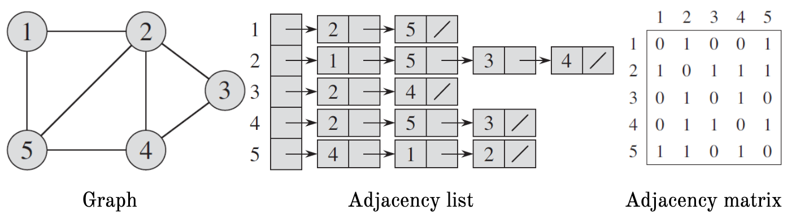

# Homework 7

## Read sections 22.1, 22.2, 22.3, and 22.4 from CLRS (skip all theoretical proofs)
Please read this with the goal of using the knowledge to do the homework below.

## Watch lectures
1. [Adjacency matrix, adjacency list, and incidece matrix representation](https://youtu.be/WQ2Tzlxl_Xo)
1. [Breadth-first search](https://youtu.be/ls4cHglfc0g)
1. [Depth-first search](https://youtu.be/qH-mHxkoK0Q) (skip the last 2 minutes)
1. [The topological sorting algorithm](https://youtu.be/pNcC8ySMQGc) 

## Additional notes

Topological sort algorithm:
```
TOPOLOGICAL-SORT(G)
   Identify the vertices that have no incoming edges (say I is the set)
   Call DFS(G) to obtain finish times v.f for each vertex
   As each vertex’s finish time is computed, insert it onto the front of a linked list
   Return the linked list of vertices
```
Types of tree edges in depth-first forest:  


## Question 1
A job scheduling problem. Say you want to install a library called X, and it depends upon dozens of other libraries. These libraries have their own inter-dependencies but there are no circular dependencies. In other words, you have a dependency graph between all these libraries that you plan to install. Your goal is to come up with an order of these libraries such that installing the libraries by the order will eventually allow you to install X without any dependency errors. This is a form of [dependency hell](https://en.wikipedia.org/wiki/Dependency_hell). For this particular situation, what algorithm will you use?

## Question 2
Say, A, B, C, D, E, and F are activities with dependencies shown below. Which of the following is a topological sort (sorted left to right), and which is not? Mention why.  


## Question 3
For the graph below prepare an adjacency matrix, and adjacency list representation (in paper or in computer). An example is provided.


Example representations:  


## Question 4
The [NetworkX](https://networkx.github.io/) library in Python implements many methods for graph processing. This library is fun to use; here is an [example](./NetworkX.ipynb). According to the [NetworkX documentation](https://networkx.github.io/documentation/stable/_downloads/networkx_reference.pdf) the library is implemented using adjacency list representation (not adjacency matrix). What are the advantages and disadvantages of such a representation? Why do you think that the library was chosen to be implemented using the adjacency list representation? Hint: see CLRS section 22.1.

## Question 5 (programming)
The **incidence matrix** of a directed graph G = (V, E) with no self-loops is a |V| x |E| matrix B = (b<sub>ij</sub>) such that b<sub>ij</sub> = -1 if edge j leaves vertex i, 1 if edge j enters vertex i, and 0 otherwise. For the graph shown below, (a) complete the function below such that it computes this incidence matrix B, and (b) describe what the diagonal of the matrix dot product B.B<sup>T</sup> represents, and what the values of the non-diagonal elements represent. B<sup>T</sup> is the transpose of B. Note that only the `adjacency2incidence` method needs to be implemented, rest is done.


```python
import numpy as np
adjacency_matrix = np.asarray([[0, 1, 1, 0], [1, 0, 0, 1], [0, 1, 0, 0], [0, 0, 1, 0]])

def adjacency2incidence(A):
    # TO DO:


    # of course, you must remove the line below
    B = np.asarray([[-1, 1, 0, 0], [-1, 0, 1, 0], [0, -1, 0, 1], [0, 1, -1, 0], [0, 0, 1, -1], [1, -1, 0, 0]])
    return B.T # depending on how you implement this may be B only

print('Adjacency matrix:')
print(adjacency_matrix)
B = adjacency2incidence(adjacency_matrix)
print('Incidence matrix:')
print(B)
print('Degree matrix:')
print(B.dot(B.T))
```

Output:
```
Adjacency matrix:
[[0 1 1 0]
 [1 0 0 1]
 [0 1 0 0]
 [0 0 1 0]]
Incidence matrix:
[[-1 -1  0  0  0 -1]
 [ 1  0 -1  1  0 -1]
 [ 0  1  0 -1  1  0]
 [ 0  0  1  0 -1  0]]
Degree matrix:
[[ 3 -2 -1  0]
 [-2  4 -1 -1]
 [-1 -1  3 -1]
 [ 0 -1 -1  2]]
```

## Question 6
What **minimal** changes can be made to the following BFS **algorithm** so that (i) accepts a destination node, (ii) terminates when a destination node is found, and (iii) the algorithm becomes a depth-first search. Submit a single algorithm with all changes in it, i.e. do not submit three separate modifications.


## Question 7
The running time of DFS and BFS is O(V+E). Discuss how aggregate analysis (ammortized analysis) applies to derive this running time.

## Question 8
For the following two graphs, trace the depth-first search algorithm. Assume that the DFS procedure considers the vertices in **reverse alphabetical order**. Also assume that the adjacency list is ordered reverse-alphabetically. Submit: (i) DFS tree/forest, (ii) Show the discovery and finishing times for each vertex, and (iii) the ordering of the vertices produced by a topological sorting algorith. The [NetworkX](https://networkx.github.io/) library implements the topological sorting algorithm that can be called on a graph (see code block below). Use the code block to verify your topological order. Hints: (i) topological sorting only works on acyclic graphs, (ii) there can be many correct solutions for a topological soring problem.


```python
import networkx as nx
# Build a directed graph
DG = nx.DiGraph(
DG.add_edge('a', 'b')
DG.add_edge('a', 'c')
DG.add_edge('b', 'd')
DG.add_edge('d', 'e')
DG.add_edge('c', 'e')
# Visualize the graph
nx.draw(DG, alpha = 0.5, with_labels = True)
# Run topological sorting, and print the order
print(list(nx.topological_sort(DG)))
```


