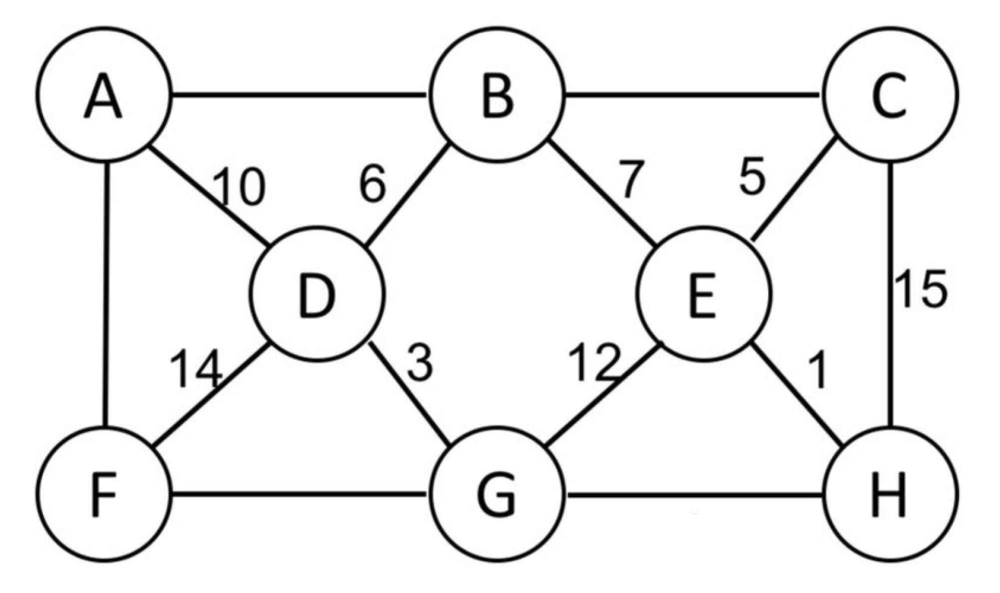
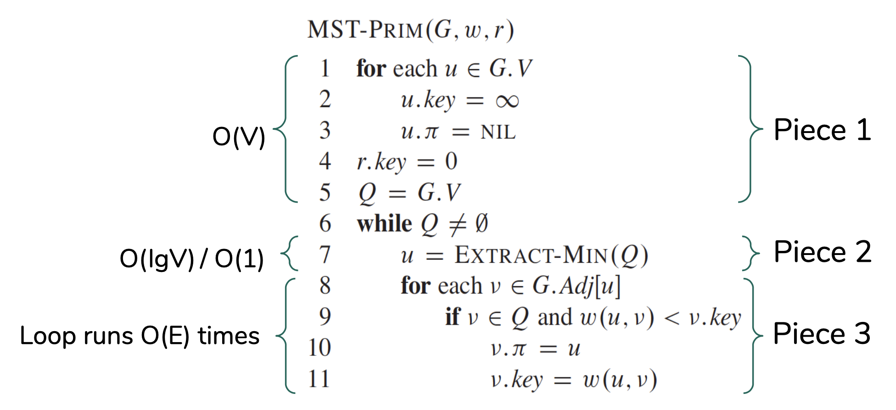

# Homework 8

## Read sections 23.1,  from CLRS (skip all theoretical proofs)
Please read this with the goal of using the knowledge to do the homework below.

## Understand the muddy city problem
[The muddy city problem](./muddy_city_problem.md)

## Watch lectures
What is a minimum spanning tree?
1. [What are trees and spanning trees?](https://youtu.be/qD6taefu3-Q)
1. [What is a minimum spanning tree](https://youtu.be/5INWifzqStU)

The Kruskal's algorithm
1. [Intuition of Kurskal's algorithm](https://youtu.be/AYC1N2QG_VM)
1. [Kruskal's GIF](https://en.wikipedia.org/wiki/Kruskal%27s_algorithm#/media/File:KruskalDemo.gif)
1. [The Find() and Union() methods in disjoint set](https://youtu.be/UBY4sF86KEY) (only the first two minutes, i.e. skip the implementation)
1. [Tracing the Kruskal's algorithm](https://youtu.be/5xosHRdxqHA?t=83) (only up to 4:43, i.e. skip the implementation)

The Prim's algorithm
1. [Intuition of Prim's algorithm](https://youtu.be/c0KKW9Fcve4)
1. [Prim's GIF](https://en.wikipedia.org/wiki/Prim%27s_algorithm#/media/File:PrimAlgDemo.gif)
1. [Tracing the Prim's algorithm](https://youtu.be/z1L3rMzG1_A) (first five minutes only, i.e. skip the implementation)

How do the Kruskal's and Prim's algorithms work?
1. [The cut property](https://youtu.be/QYdZS4S-FyU)

## Question 1
Assign the houses in the muddy city map, the names of US states. In other words, assin US state names to the houses. Assume that paving the bridge costs thrice more than a stone. Obtain a solution using your own intuition (hit and trial), without using any computing techniques. Verify your solution using the NetworkX library (see example code block below).

```python
import networkx as nx
G = nx.Graph()
G.add_edge('a', 'b', weight = 4)
G.add_edge('b', 'c', weight = 8)
MST = nx.minimum_spanning_tree(G)
nx.draw(G, alpha = 0.8, with_labels = True)
```

## Question 2
Say that we have a larger muddy city with `N` houses. To interconnect all the houses we can use an arrangement of `N-1` roads, each connecting two houses. Assuming that the cost of connecting any two houses is fixed (same), how many arrangements are possible (in terms of N)? Hint: Consider the worst case scenario, i.e. the graph could be a [complete graph](https://en.wikipedia.org/wiki/Complete_graph).

## Question 3
Showing all the intermediate steps, obtain a MST using Kruskal's algorithm for the graph below. Assume that the following weights between the nodes that have missing weights: A-B:11, B-C:9, A-F:2, F-G:13, and G-H:4. An example solution, for a different problem, is [here](./kruskals_example.pdf). After obtaining the answer, verify your solution using the NetworkX library.



## Question 4
Showing all the intermediate steps, obtain a MST using Prim's algorithm for the graph above (same graph). Assume that the following weights between the nodes that have missing weights: A-B:11, B-C:9, A-F:12, F-G:13, and G-H:4. Note that the weights are slightly different. An example solution, for a different problem, is [here](./prims_example.pdf). After obtaining the answer, verify your solution using the NetworkX library.

## Question 5
Consider the Prim's algorithm below.



We are interested to calculate the time complexity (running time) of the algorithm in terms of big-O by analyzing the time taken by the various segments of the algorithm.
* Segment 1. These initializations take O(V) time.
* Segment 2. The total time for all calls to `Extract-Min(Q)` operations is `O(V * time for Extract-Min())`. A priority queue's `Extract-Min(Q)` operation can take [various running times](https://en.wikipedia.org/wiki/Priority_queue) based on the implementation. If the priority queue is implemented using binary min-heap, the time complexity of `Extract-Min(Q)` is `O(lgV)`. On the other hand, if priority queue is implemented using Fibonacci heap, the time complexity is `O(1)`.
* Segment 3. We scan the adjacency list of each vertex once which takes `O(E)` time. Let’s assume that the time needed for `v.𝝅 = u` and `v.key = w(u,v)` is `t` so that total time is `O(t * E)`. Every time the `v.key` and `v.𝝅` are updated, the priority queue (heap) has to be updated.

Calculate the total time complexity (in terms of the three parts if (a) fibonacci heap is used, (b) binary heap is used.

## Question (last)
A *dense graph* is a graph in which the number of edges is close to the maximal number of edges, and a *sparse graph* is a graph in which the number of edges is close to the minimal number of edges. The running time Kruskal’s algorithm is O(E lg V) and the running time of Prim’s algorithm (when we use Fibonacci heap for priority queue) is O(E + V lgV). Is the following statement correct, "Prim's algorithm is a better (faster) choice when you want to find MST for a dense graph"? Explain.

## Question 3
One may argue that for a problem such as the muddy city problem, if a few 'genious' people an hour or two on the problem then there is no need to find a 'computer programmer' to translate the problem into a programming problem and run these MST agorithms to find a solution. In addition, the person may further argue that having an algorithm is enough, there is no need to analyze the big-O and precisely choose an algorithm. Do you agree? Provide your reasons. Hint: Read the [applications of MST algorithms](https://en.wikipedia.org/wiki/Spanning_tree).

