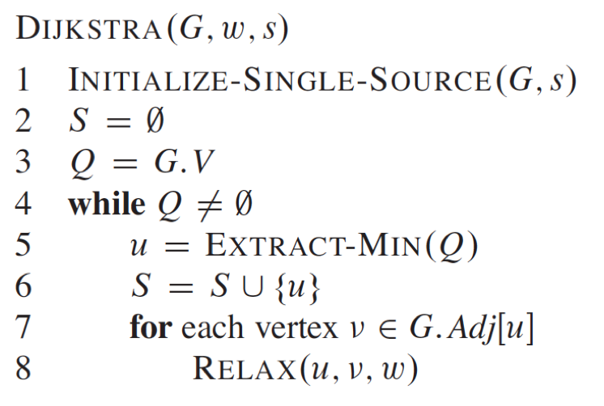
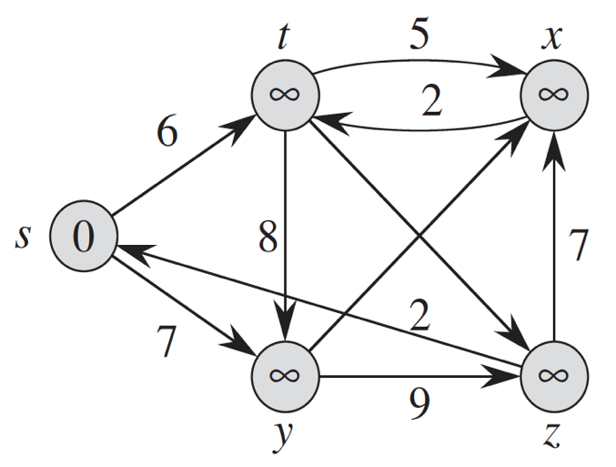
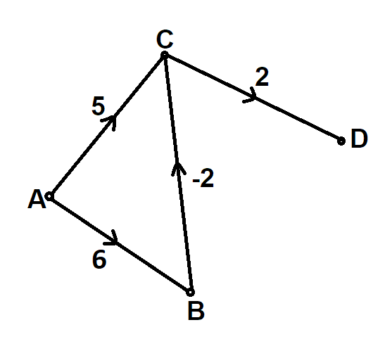
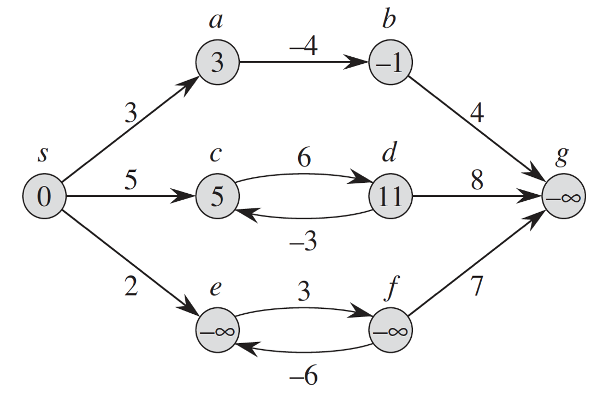
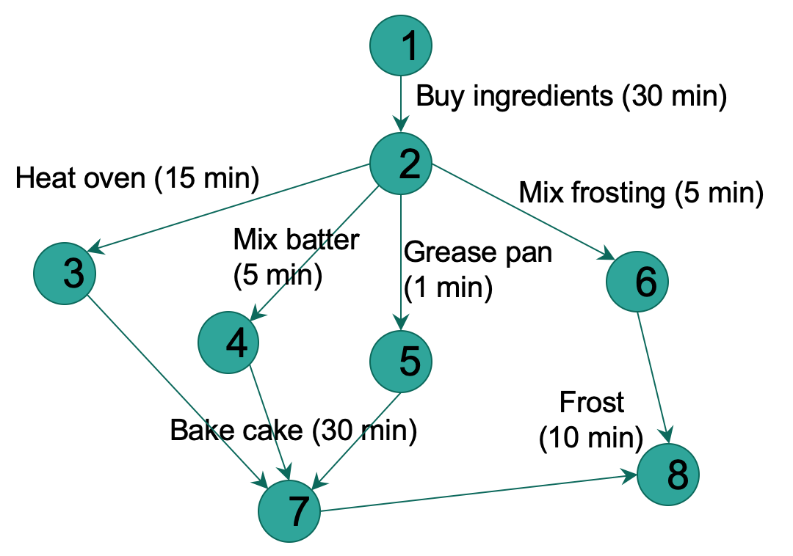
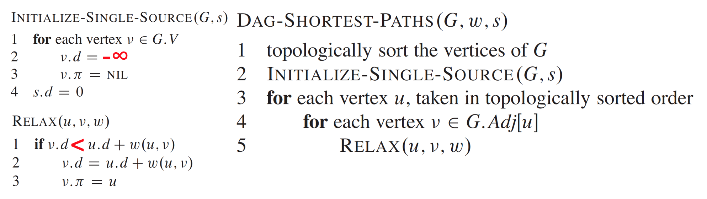
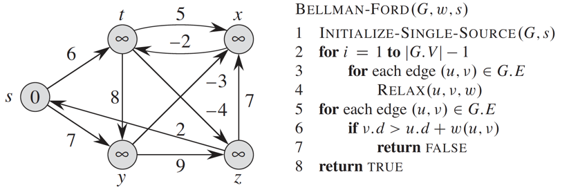
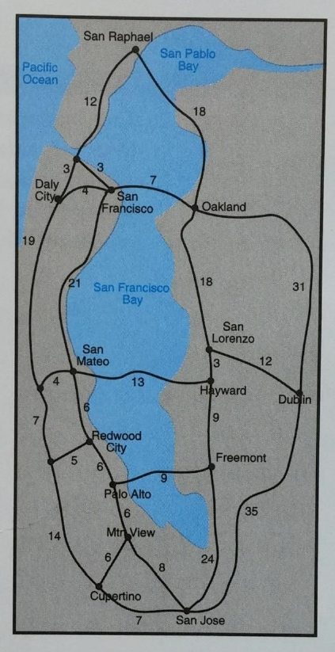

# Homework 9

## Read sections 24, 24.1, 24.2, and 24.3 from CLRS
Please read this with the goal of using the knowledge to do the homework below.

## Understand the single-source shortest path problem
[Single-source shortest path problem](https://youtu.be/AkOm0vcjdPs)

## Watch lectures
1. [Optimal substructure of a shortest path](https://youtu.be/FsKnhJYVti4)
1. [Negative weight edges and negative weight cycle in a directed graph](https://youtu.be/0HXYTi6ZG5Q)
1. [Representing shortest paths and Relaxation](https://youtu.be/fqcSpN9sLTo)
1. [Bellman-Ford algorithm & Dijkstra's algorithm](https://youtu.be/CjDt97wuCI0)

## Question 1
Trace the Dijkstra's algorithm to obtain shortest paths to all other nodes from the node `s`. Assume that the weights for the edge (y,x) is 3 and (t,z) is 4.   

## Question 2
For the Dijkstra's algorithm to successfully produce a shortest path and the shortest path cost, all the weights must be nonnegative.

**Part A:** Try running Dijkstra's algorithm on the graph below assuming `A` is the source node and discuss why Dijkstra's algorithm fails.

**Part B:** Clearly, this is a limitation of the algorithm. Say someone suggested that this limitation can be 'smartly' overcome by adding a constant to all the weights so that all the weights become nonnegative. Can such a 'trick' yield a shortest path and the shortest path cost? What is a 'potential' issue with this approach? Create a small graph with at least one negative weight and explain.

## Question 3
A shortest path cannot contain a negative weight cycle. Nor can it contain a positive weight cycle. Because we can get a shorter path by removing such a cycle. Negative weight cycles in a directed graph can be an issue when computing shortest paths. Can we compute a shortest path from `a` to `g` in the graph below using the Dijkstra's algorithm or Bellman-Ford algorithm? Explain.    

## Question 4
In the Dijkstra's algorithm (above), assume that the cost of each `EXTRACT-MIN` operation is O(lg V). If each `RELAX` operations takes O(V) time, what will be time complexity of the overall algorithm terms of Big-O?  

## Question 5
Shortest paths are always well defined in a directed acyclic graph (DAG). This is because even if there are negative weight edges, no negative-weight cycles can exist. Hence, we don't need to run Dijkstra's algorithm of Bellman-Ford algorithm. A faster algorithm `DAG-SHORTEST-PATHS(G, w, s)` (`G` is the graph (V,E), `w` is weight matrix, and `s` is starting node) with a running time of Θ(V+E) can be used to calculate the shortest paths (see below). An interesting application of this arises in determining 'critical paths', i.e. paths with lowest cost. For the directed acyclic graph below that shows the time needed to perform various activities to bake a cake, determine a critical path (i.e. the quickest we could bake the cake) using the algorithm `DAG-SHORTEST-PATHS()` below. In the graph, edges represent jobs to be performed, and edge weights represent the times required to perform particular jobs. If edge (u,v) enters vertex v and edge (v, x) leaves v, then job (u,v) must be performed before job (v,x). A path through this DAG represents a sequence of jobs that must be performed in a particular order. A critical path is a shortest (longest) path through the DAG, corresponding to the shortest (longest) time to perform any sequence of jobs. The weight of a critical path provides a lower (upper) bound on the total time to perform all the jobs.  

Since we are actually interested in the 'minimum' time, the weights (time in minutes) must be negated before running the algorithm below. Also, the standard `RELAX()` and `INITIALIZE-SINGLE-SOURCE()` will need to be updated as shown below. Show your topological ordering. Clearly show how the `RELAX()` operation changes the value of 'shortest path estimate' and 'predecessor attribute' of the Node 7. Nodes should be processed in the order of their numbers.

## Question 6
For the following graph, in how many executions of the 'outer for loop' (line #2) will the Bellman-Ford algorithm find the shortest-paths, if you consider edges by:
1. Non-decreasing weights (starting with the smallest weight)?
1. Non-increasing weights (starting with the largest weight)?
1. In the following order: (t,x), (t,y), (t,z), (x,t), (y,x), (y,z), (z,x), (z,s), (s,t), (s,y)?  

Can we conclude that selecting edges by non-increasing or non-decreasing weights will make the algorithm converge faster?   

## Question 7 (programming)
Find shortest paths between Mountain View and all other places in the map of Silicon Valley below. As your answer, provide the list of all
the places and their corresponding shortest distance sorted by the shortest distance. You are welcome to use any 'libraries' or 'publicly available code'.   

