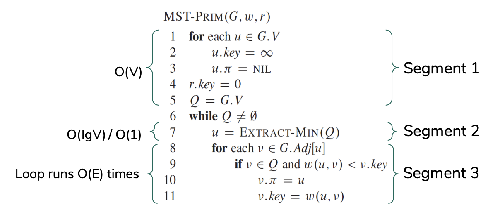

# Homework 9

<!---
## Read sections 24, 24.1, 24.2, and 24.3 from CLRS
Please read this with the goal of using the knowledge to do the homework below.

## Understand the single-source shortest path problem
[Single-source shortest path problem]()

## Watch lectures
1. [What are trees and spanning trees?](https://youtu.be/qD6taefu3-Q)
1. Optimal substructure
1. Negative weight cycle
1. Initialize and Relax

## Question 1
For the Dijkstra's algorithm to successfully produce a shortest path and the shortest path cost, all the weights must be nonnegative. Clearly, this is a limitation of the algorithm. Say someone suggested that this limitation can be 'smartly' overcome by adding a constant to all the weights so that all the weights become nonnegative. Can such a method yeild a shortest path and the shortest path cost? What is a 'potential' issue with this approach? Create a small graph with at least one negative weight and explain.

## Question 2
Negative weight cycles in a directed graph can be an issue when computing shortest paths. Can we compute a shortest path from `a` to `g` in the graph below using the Dijkstra's algorithm or Bellman-Ford algorithm? Explain.  


## Question 3
In the following Dijkstra's algorithm, assume that the cost of each `EXTRACT-MIN` operation is O(lg V). If each `RELAX` operations takes O(V) time, what will be time complexity of the overall algorithm below in terms of Big-O?  


## Question 4
Shortest paths are always well defined in a directed acyclic graph (DAG). This is because even if there are negative weight edges, no negative-weight cycles can exist. Hence, we don't need to run Dijkstra's algorithm of Belman-Ford algorith. A simpler algorithm `DAG-SHORTEST-PATHS()` (see below) can be used to calculate the shortest paths. An interesting application of this arises in determining 'critical paths', i.e. paths with lowest cost. For the directed acyclic graph below that shows the time needed to perform various activities to bake a cake, determine a critical path (i.e. the quickest we could bake the cake) using the algorithm `DAG-SHORTEST-PATHS()` below. Since we are actually interested in the 'minimum' time, the weights (time in minutes) must be negated before running the algorithm below. Also, the standard `RELAX()` and `INITIALIZE-SINGLE-SOURCE()` will need to be updated as shown below. Show your topological ordering. Clearly show how the `RELAX()` operation changes the value of 'shortest path estimate' and 'predecessor attribute' of the Node 7. Process by their numbers.


run dijkstra's algorithm/bellman ford algorithm on the same graph (weights in the question itself) and verify using the networkx library.

pert problem on baking problem. show topological order first. focus how the relaxation works on node 7.

bellman ford, ask to run all three versions. ask which version is fastest?


## Understand the muddy city problem
[The muddy city problem](./muddy_city_problem.md)

## Watch lectures
What is a minimum spanning tree?
1. [What are trees and spanning trees?](https://youtu.be/qD6taefu3-Q)
1. [What is a minimum spanning tree?](https://youtu.be/5INWifzqStU)

The Kruskal's algorithm
1. [Intuition of Kruskal's algorithm](https://youtu.be/AYC1N2QG_VM)
1. [Kruskal's GIF](https://en.wikipedia.org/wiki/Kruskal%27s_algorithm#/media/File:KruskalDemo.gif)
1. [The Find() and Union() methods in disjoint set](https://youtu.be/UBY4sF86KEY) (only the first two minutes, i.e. skip the implementation)
1. [Tracing the Kruskal's algorithm](https://youtu.be/5xosHRdxqHA?t=83) (only up to 4:43, i.e. skip the implementation)

The Prim's algorithm
1. [Intuition of Prim's algorithm](https://youtu.be/c0KKW9Fcve4)
1. [Prim's GIF](https://en.wikipedia.org/wiki/Prim%27s_algorithm#/media/File:PrimAlgDemo.gif)
1. [Tracing the Prim's algorithm](https://youtu.be/z1L3rMzG1_A) (first five minutes only, i.e. skip the implementation)

How do the Kruskal's and Prim's algorithms work?
1. [The cut property](https://youtu.be/QYdZS4S-FyU)

## Question 1 (partial programming)
Assign the houses in the muddy city map the names of US states, and draw it as a weighted graph. Assume that paving the bridge costs **three times** more than one stone. Obtain a solution using your own intuition/hit-and-trial, without using any computing techniques. Verify your solution using the NetworkX library (see example code block below).

```python
import networkx as nx
G = nx.Graph()
G.add_edge('a', 'b', weight = 4)
G.add_edge('b', 'c', weight = 8)
MST = nx.minimum_spanning_tree(G)
nx.draw(G, alpha = 0.8, with_labels = True)
```

## Question 2
Say that we have a larger muddy city with `N` houses. To interconnect all the houses, we can use an arrangement of `N-1` roads, each connecting two houses. Assuming that the cost of connecting any two houses is fixed (same), how many arrangements are possible (in terms of N)? Hint: Consider the worst case scenario, i.e. the graph could be a [complete graph](https://en.wikipedia.org/wiki/Complete_graph).

## Question 3 (partial programming)
Showing all the intermediate steps, obtain a MST using Kruskal's algorithm for the graph below. Assume the following weights between the nodes that have missing weights: A-B:11, B-C:9, A-F:2, F-G:13, and G-H:4. An example solution, for a different problem, is [here](./kruskals_example.pdf). After obtaining the answer, verify your solution using the NetworkX library.


## Question 4 (partial programming)
Showing all the intermediate steps, obtain a MST using Prim's algorithm for the graph above (same graph but slightly different weights). Assume the following weights between the nodes that have missing weights: A-B:11, B-C:9, A-F:12, F-G:13, and G-H:4. Note that the weights are slightly different. An example solution, for a different problem, is [here](./prims_example.pdf). After obtaining the answer, verify your solution using the NetworkX library.

## Question 5
Consider the Prim's algorithm below. Here, `G` represents the graph, `w` is the 2D weight matrix, and `r` is the starting vertex. `Q` is a minimum priority queue. `v.key` is the distance from the current minimum spanning tree to `v` and `v.𝝅` is for storing the parent of `v`. 



We are interested to calculate the time complexity (running time) of the algorithm in terms of big-O by analyzing the time taken by the various segments of the algorithm.
* Segment 1. These initializations take O(V) time.
* Segment 2. The total time for all calls to `Extract-Min(Q)` operations is `O(V * time for Extract-Min(Q))`. A priority queue's `Extract-Min(Q)` operation can take [various running times](https://en.wikipedia.org/wiki/Priority_queue) based on the implementation. If the priority queue is implemented using binary min-heap, the time complexity of `Extract-Min(Q)` is `O(lgV)`. On the other hand, if priority queue is implemented using Fibonacci heap, the time complexity is `O(1)`.
* Segment 3. We scan the adjacency list of each vertex once which takes `O(E)` time. Let’s assume that the time needed for `v.𝝅 = u` and `v.key = w(u,v)` is `t` so that total time is `O(t * E)`. Every time the `v.key` and `v.𝝅` are updated, the priority queue (heap) has to be updated.

Calculate the time complexity of the `MST-PRIM()` algorithm in terms of the three segments, if (a) Fibonacci heap is used, (b) binary heap is used.

## Question 6
A *dense graph* is a graph in which the number of edges is close to the maximal number of edges, and a *sparse graph* is a graph in which the number of edges is close to the minimal number of edges. The running time of Kruskal’s algorithm is O(E lg V) and the running time of Prim’s algorithm (when we use Fibonacci heap for priority queue) is O(E + V lgV). Is the following statement correct, "Prim's algorithm is a better (faster) choice when you want to find MST for a dense graph"? Explain.

## Question 7
One may argue that for a problem such as the muddy city problem, if a few 'genius' people spend an hour or two on the problem it can be easily solved, and that there is no need to find a 'computer programmer' to translate the problem into a programming problem and run these MST algorithms to find a solution. In addition, the person may further argue that having an algorithm is enough, there is no need to analyze the big-O and *precisely* choose an algorithm. Do you agree? Provide your reasons. Hint: Read the [applications of MST algorithms](https://en.wikipedia.org/wiki/Spanning_tree).

-->
