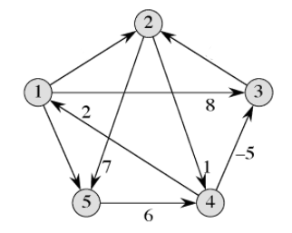
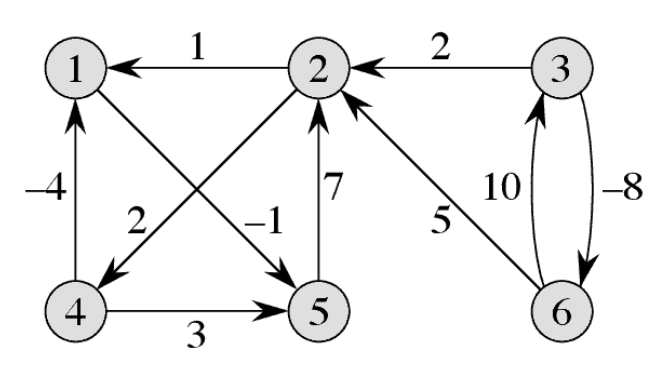
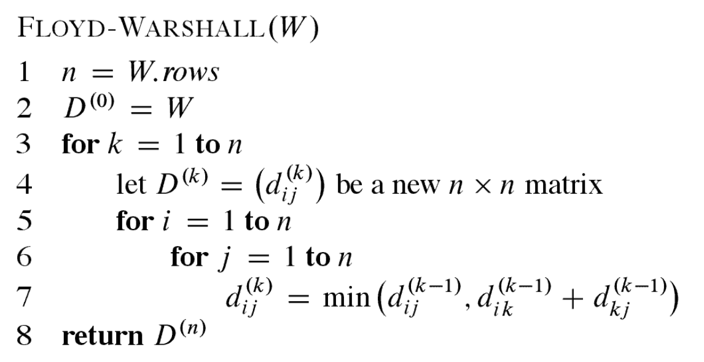
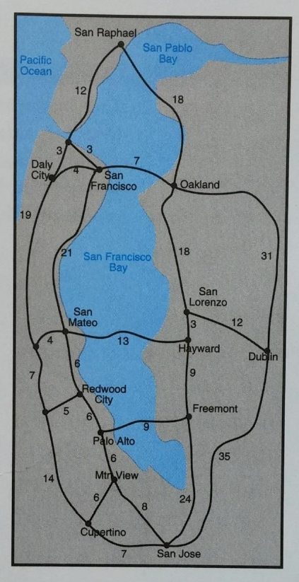
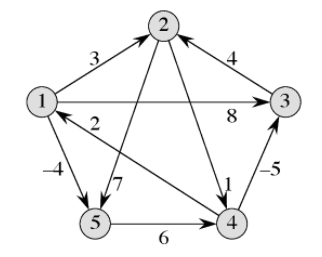

# Homework 10

## Read sections 25, 25.1 and 25.2 from CLRS
Please read this with the goal of using the knowledge to do the homework below.


## Watch lectures
1. [Running time of all-pair shortest path algorithms - Floyd-Warshall and Dynamic programming](https://youtu.be/s_0Il523Fio)
1. [All-pair shortest path using dynamic programming](https://youtu.be/Yzd_slZcuyA)
1. [Floyd–Warshall algorithm](https://youtu.be/4OQeCuLYj-4)

## Question 1
The time complexity of the Dijkstra's algorithm, when the priority queue is implemented using Fibonacci heap, is O(VlgV+E) and that of the Bellman-Ford algorithm is O(VE). These are both single-source shortest path algorithms. One straight-forward technique to obtain all-pair shortest paths is to run one of these two algorithms for every vertex in the graph. This makes the running times O(V<sup>2</sup>lgV+VE)) and O(V<sup>2</sup>E)) respectively. What will be the running times for (a) sparse graph, (b) dense graph, **in terms of E**?

## Question 2
If a dense graph does not have negative weights, is it theoritically equivalent (in terms of speed) to run Dijkstra's algorithm |V| times instead of the Floyd-Warshall algorithm? Why?

## Question 3
Mary wants to solve the single-source shortest path problem on a dense graph with negative weights but she has the Floyd-Warshall all-pair shortest path algorithm implemented already. It is ok (in terms of speed) to use the implementation that she already has? Explain.

## Question 4
Original question: For the directed graph below, trace the dynamic programming implementation for calculating all-pair shortest path to obtain the all-pair shortest paths. Calculate L<sup>(1)</sup>, L<sup>(2)</sup>, L<sup>(3)</sup>, L<sup>(4)</sup>, and L<sup>(5)</sup>. For the missing weights assume the following weights: {(1,2): 1, (1,5): -1, and (3,2):1}. Verify your answers using the implementation in the appendix. (There is a negative weight cycle so your answers may not match.)

Corrected question (please ignore this if you already submitted): For the directed graph below, trace the dynamic programming implementation for calculating all-pair shortest path to obtain the all-pair shortest paths. Calculate L<sup>(1)</sup>, L<sup>(2)</sup>, L<sup>(3)</sup>, L<sup>(4)</sup>, and L<sup>(5)</sup>. For the missing weights assume the following weights: {(1,2): 1, (1,5): -1, and (3,2):10}. Verify your answers using the implementation in the appendix. 



## Question 5
Run the Floyd-Warshall algorithm on the following weighted, directed graph and **show the matrix D<sup>(k)</sup>** that results in each iteration of the outer loop. Here the input W is a `n x n` weight matrix where n is the number of vertices. d<sub>ij</sub><sup>(k)</sup> is the weight of the shortest path from vertex i to vertex j for which all intermediate vertices are in the set {1, 2, ..., k}. When k = 0, d<sub>ij</sub><sup>(0)</sup> = w<sub>ij</sub>.




## Question 6 (programming)
Find shortest paths between all 'named' places in the map of Silicon Valley below. As your answer, provide a table of all-pair shortest paths. You are welcome to use any 'libraries' or 'publicly available code'.   



# Appendix

## All-pair shortest path using dynamic programming (example, solution for a problem different from Q4)


```python
import numpy as np

W = np.array([[     0,      3,      8, np.inf,     -4],
              [np.inf,      0, np.inf,      1,      7],
              [np.inf,      4,      0, np.inf, np.inf],
              [     2, np.inf,     -5,      0, np.inf],
              [np.inf, np.inf, np.inf,      6,      0]])

def EXTEND_SHORTEST_PATHS(L, W):
    n = len(L[0, :])
    LL = np.full_like(L, np.inf)
    for i in range(n):
        for j in range(n):
            for k in range(n):
                LL[i, j] = min(LL[i, j], L[i, k] + W[k, j])
    return LL

def FASTER_ALL_PAIRS_SHORTEST_PATHS(W):
    n = len(W[0, :])
    LM = np.copy(W)
    m = 1
    while m < n:
        LM = EXTEND_SHORTEST_PATHS(LM, LM)
        m = 2 * m
    return LM

print('Graph:')
print(W)
print('All pair shortest path distances:')
print(FASTER_ALL_PAIRS_SHORTEST_PATHS(W))
```
Output:
```
Graph:
[[ 0.  3.  8. inf -4.]
 [inf  0. inf  1.  7.]
 [inf  4.  0. inf inf]
 [ 2. inf -5.  0. inf]
 [inf inf inf  6.  0.]]
All pair shortest path distances:
[[ 0.  1. -3.  2. -4.]
 [ 3.  0. -4.  1. -1.]
 [ 7.  4.  0.  5.  3.]
 [ 2. -1. -5.  0. -2.]
 [ 8.  5.  1.  6.  0.]]
 ```
