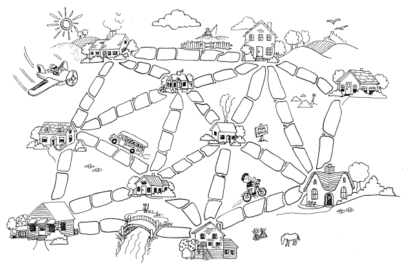

# The Muddy city problem
Once upon a time there was a city that had no roads. Getting around the city was particularly difficult after rainstorms because the ground became very muddy—cars got stuck in the mud and people got their boots dirty. The map below shows the layout of the city. The mayor of the city decided that some of the streets must be paved, but didn’t want to spend more money than necessary because the city also wanted to build a swimming pool.

The mayor therefore specified two conditions:  
1. Enough streets must be paved so that it was possible for everyone to travel from their house to anyone else’s house by a route consisting only of paved roads, possibly via other houses, and
1. The paving should be accomplished at a minimum total cost.

Remember that the mayor's condition does not include 'convinience'. As long as all houses are connected by roads, the city residents are happy.

If the number of paving stones between each house represents the cost of paving that route, what algorithm will enable us to figure out the least number of paving stones needed to allow people to get from any house to any other?

